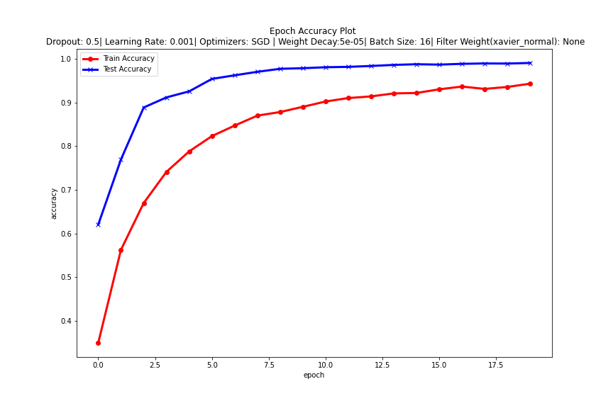
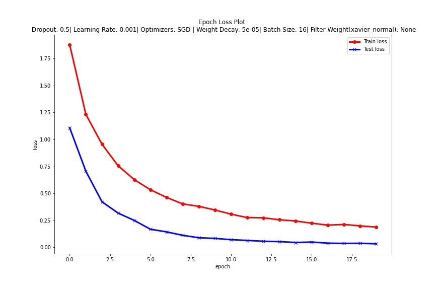

# CNN-distracted-driver-classification 

Given driver images, each taken in a car with a driver doing something in the car (texting, eating, talking on the phone, makeup, reaching behind, etc), this CNN image classifier predicts the likelihood of what the driver is doing in each picture. 

The 10 classes to predict are:

- c0: safe driving
- c1: texting - right
- c2: talking on the phone - right
- c3: texting - left
- c4: talking on the phone - left
- c5: operating the radio
- c6: drinking
- c7: reaching behind
- c8: hair and makeup
- c9: talking to passenger

The dataset used here is [State Farm Distracted Driver Detection](https://www.kaggle.com/c/state-farm-distracted-driver-detection/data) provided on Kaggle. 


## Vanilla CNN model architecture 

In this CNN image classifier, I've used a vanilla CNN architecture with Stochastic Gradient Descent optimizer. The loss function used is the Cross Entropy Loss. The total trainable parameters are ~4M generating a validation accuracy of ~99%. The model architecture is given below, 


### Steps to build 

The source code allows to train the model from scratch. The original image dimensions are (480, 640,3). I resized them into (64,64,1). The `extract_image.py` source code reads the image and resizes into the dimension (64,64,1). Also, it stores the image in a numpy format. 

To use the pre-saved image numpy file and train the classifier from scratch, follow the steps given below, 

```
$ cd /working_directory/ 
$ git clone git@github.com:yogeshgajjar/CNN-distracted-driver-classification.git
$ sh image_numpy.sh 
$ python3 /working_directory/ train 
``` 

To load the pre-trained model achieving 99% accuracy is as follows, 
```
$ cd /working_directory/
$ git clone git@github.com:yogeshgajjar/CNN-distracted-driver-classification.git
$ sh image_numpy.sh 
$ python3 /working_directory/ test 


### Performance Curves 

The model trained for 20 epochs achieves 99% accuracy. The hyper-parameters used are present on the top of the performance curves shown below. 



 


